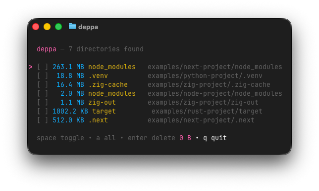

# &#129529; Deppa

> Dependency scanner and pruner

Deppa finds and deletes dependency and build output directories (`node_modules`, `target`, `.next`, etc.) that accumulate across your projects and silently consume disk space.

Deppa is written in [Go](https://go.dev) and uses [Bubble Tea](https://github.com/charmbracelet/bubbletea) for its terminal interface.

<p align="center">
  
</p>

## Usage

```bash
deppa              # Scan from the current directory
deppa ~/Developer  # Scan from a specific path
```

## Installation

```bash
go install github.com/Fuwn/deppa@latest
```

Or build from source:

```bash
git clone https://github.com/Fuwn/deppa.git
cd deppa
task build
task install
```

## Keybindings

| Key | Action |
|-----|--------|
| `j/k` | Navigate down/up |
| `space` | Toggle selection |
| `a` | Toggle all |
| `enter` | Delete selected |
| `q` | Quit |

## Detected Directories

`node_modules`, `target`, `.next`, `.nuxt`, `__pycache__`, `.venv`, `venv`, `.gradle`, `Pods`, `.zig-cache`, `zig-cache`, `zig-out`, `_build`, `.dart_tool`

Want to add a new detected or ignored directory? Open a PR to [`scanner.go`](https://github.com/Fuwn/deppa/blob/main/scanner.go) after testing.

## Licence

Licensed under either of [Apache License, Version 2.0](LICENSE-APACHE) or
[MIT license](LICENSE-MIT) at your option.

Unless you explicitly state otherwise, any contribution intentionally submitted
for inclusion in this crate by you, as defined in the Apache-2.0 license, shall
be dual licensed as above, without any additional terms or conditions.
